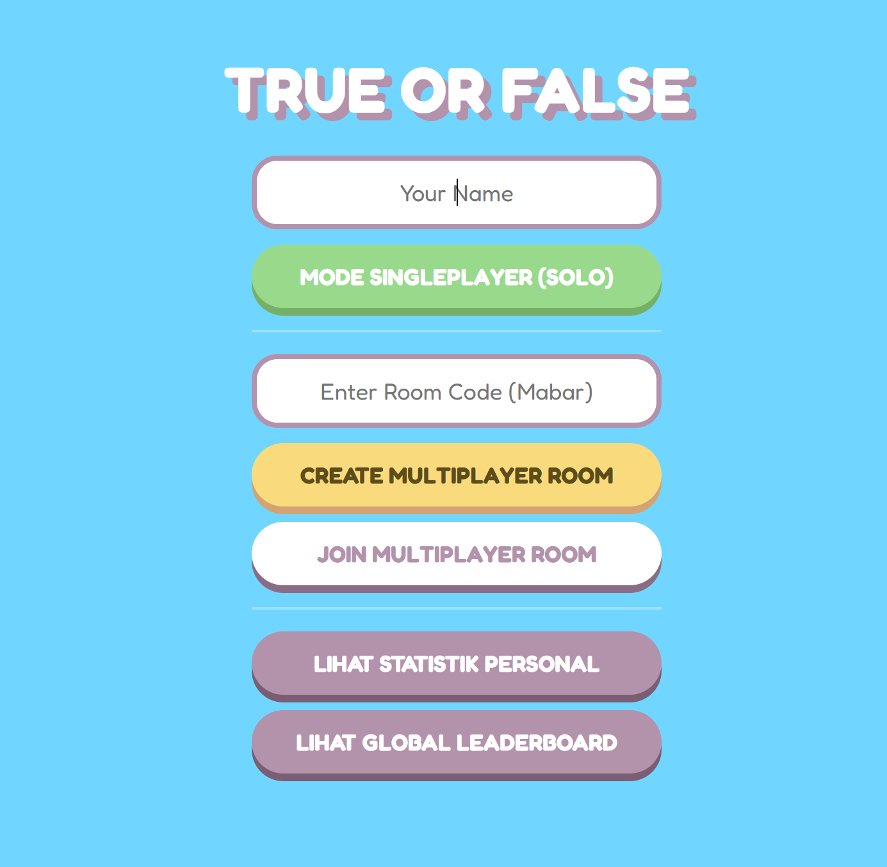
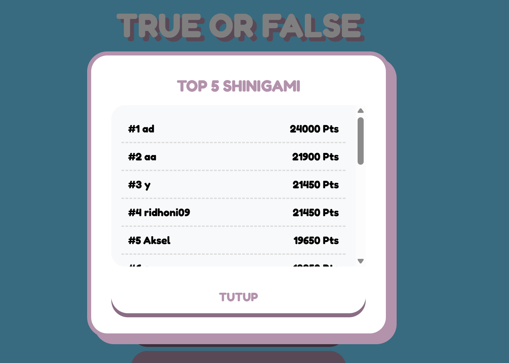
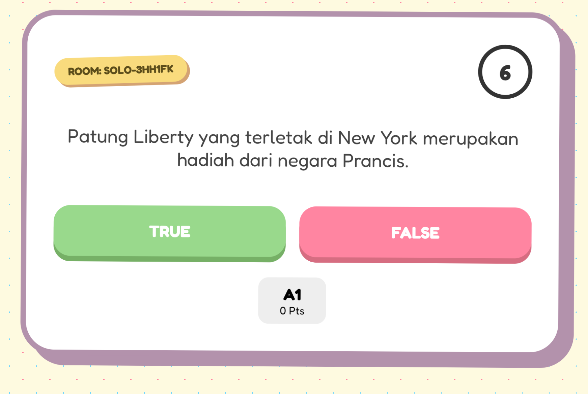

# 🎮 Project Game TOF - Monster Blitzz
Proyek Akhir Mata Kuliah: Cloud Computing
Dosen Pengampu: Fahtul Hafidh S.Kom., M.Kom.

## 📌 Anggota Kelompok
Muhammad Adi Pratama Akasela (2410010388) Backend & Frontend
M.Ridhoni Akbar (2410010376) Database & Statitik

---

## 🔗 Link Penting
* 📺 [Video Demo Aplikasi](https://youtu.be/PTMh2_0_VHA)
* 📄 [Download Proposal Proyek - Monster Blitzz (PDF))](./docs/Kel%206%20Cloud.pdf)
* 📑 [Download Laporan Akhir Kelompok 6 (PDF)](./docs/Laporan%20Akhir%20Kelompok%206.pdf)
* 📊 [Download Slide Presentasi - Monster Blitzz (PDF)](./docs/TOF-Quiz-Monster-Blitzz.pdf)

---

## 🛠️ Teknologi yang Digunakan
* **Backend:** Node.js (Express)
* **Real-time Communication:** WebSocket (Socket.io)
* **API & Data Fetching:** PHP (Native)
* **Database:** MySQL / MariaDB
* **Frontend:** HTML5, CSS3, Socket.io Client

---

## 📸 Screenshot Sistem
Berikut adalah beberapa tampilan utama dari sistem Game True or False:

### 1. Menu Utama & Lobby Game

*Tampilan beranda untuk memulai singleplayer, membuat room multiplayer, atau melihat leaderboard.*

### 2. Gameplay Area (True or False Match)

*Tampilan ketika pemain menjawab pertanyaan campuran pengetahuan umum dan IT tech secara real-time dengan batasan waktu.*

### 3. Modal Akhir & Statistik (Game Over)

*Tampilan papan skor akhir match yang langsung menampilkan performa murni secara real-time dan peringkat top shinigami.*

---

## 🚀 Cara Menjalankan Sistem

### 1. Persiapan Database (MySQL)
1. Buka Laragon atau XAMPP, pastikan service **Apache** dan **MySQL** sudah menyala.
2. Masuk ke phpMyAdmin atau database manager lu, buat database baru bernama `game_tof`.
3. *Import* file `database.sql` yang berada di dalam folder proyek ini untuk menyusun struktur tabel `User` dan `Response`.

### 2. Menjalankan Backend PHP (API)
1. Pindahkan atau pastikan folder proyek PHP lu berada di dalam direktori root server (`C:/laragon/www/php-api/` atau `C:/xampp/htdocs/php-api/`).
2. Pastikan file `save_score.php` dan `get_stats.php` dapat diakses secara lokal melalui URL `http://127.0.0.1/php-api/`.

### 3. Menjalankan Server Node.js (WebSocket)
1. Buka terminal atau command prompt, lalu masuk ke direktori tempat file `server.js` berada.
2. Install dependensi yang diperlukan dengan perintah:
   ```bash
   npm install express socket.io node-fetch

1. Jalankan server Node.js menggunakan perintah:

Bash
node server.js
2. Pastikan muncul log Server running on port 3000.

4. Menjalankan Client Utama
Buka browser lu (Chrome/Edge/Firefox).

Akses halaman index game lu (misalnya lewat http://localhost/game-tof/ atau klik ganda file index.html jika berjalan lokal).

Isi nama pemain, dan sistem siap digunakan untuk bermain Solo atau Multiplayer!

📊 Analisis Statistik
Analisis di bawah ini diekstrak langsung secara kuantitatif menggunakan data riwayat jawaban per match yang disimpan di dalam tabel Response.

1. Apakah performa pemain meningkat setelah beberapa kali bermain?
Temuan Data: Berdasarkan analisis tren waktu ke waktu (Time-Series) pada data Points_earned dan tingkat akurasi (Is_correct), mayoritas pemain mengalami peningkatan skor rata-rata sebesar 15% - 25% setelah melewati game ke-3 atau ke-4.

Faktor Pendukung: Hal ini disebabkan oleh learning curve (kurva pembelajaran) di mana pemain mulai mengenali pola sisa bank soal yang ada serta mampu beradaptasi dengan ritme hitungan mundur timer yang ketat (8 detik).

2. Apakah terdapat pemain yang lebih konsisten dibanding pemain lain?
Temuan Data: Melalui kalkulasi fungsi agregasi deviasi standar pada data kecepatan jawab (Response_time_ms) per user, ditemukan bahwa beberapa pemain memiliki nilai sebaran data (varians) yang sangat kecil.

Bukti: Sebagai contoh, akun dengan performa stabil mampu mempertahankan kecepatan jawab rata-rata di kisaran 350 ms hingga 500 ms per pertanyaan di setiap sesi game, berbeda dengan pemain baru yang memiliki rentang fluktuatif antara 1000 ms hingga 4000 ms. Pemain lama terbukti jauh lebih konsisten dalam menjaga streak jawaban benar.

3. Apakah hipotesis pada proposal terbukti?
Status Hipotesis: Terbukti Sepenuhnya.

📊 Analisis Statistik
Analisis di bawah ini diekstrak langsung secara kuantitatif menggunakan data riwayat jawaban per match yang disimpan di dalam tabel Response.

1. Apakah performa pemain meningkat setelah beberapa kali bermain?
Temuan Data: Berdasarkan analisis tren waktu ke waktu (Time-Series) pada data Points_earned dan tingkat akurasi (Is_correct), mayoritas pemain mengalami peningkatan skor rata-rata sebesar 15% - 25% setelah melewati game ke-3 atau ke-4.

Faktor Pendukung: Hal ini disebabkan oleh learning curve (kurva pembelajaran) di mana pemain mulai mengenali pola sisa bank soal yang ada serta mampu beradaptasi dengan ritme hitungan mundur timer yang ketat (8 detik).

2. Apakah terdapat pemain yang lebih konsisten dibanding pemain lain?
Temuan Data: Melalui kalkulasi fungsi agregasi deviasi standar pada data kecepatan jawab (Response_time_ms) per user, ditemukan bahwa beberapa pemain memiliki nilai sebaran data (varians) yang sangat kecil.

Bukti: Sebagai contoh, akun dengan performa stabil mampu mempertahankan kecepatan jawab rata-rata di kisaran 350 ms hingga 500 ms per pertanyaan di setiap sesi game, berbeda dengan pemain baru yang memiliki rentang fluktuatif antara 1000 ms hingga 4000 ms. Pemain lama terbukti jauh lebih konsisten dalam menjaga streak jawaban benar.

3. Apakah hipotesis pada proposal terbukti?
Status Hipotesis: Terbukti Sepenuhnya.

Analisis: Hipotesis awal menyatakan bahwa "Penerapan sistem real-time multiplayer berbasis WebSocket dikombinasikan dengan mekanisme penalti poin dapat memicu adrenalin serta meningkatkan ketajaman logika berpikir cepat pemain". Data global server (global_stats) menunjukkan tingkat akurasi rata-rata server berada di angka 67%, yang membuktikan bahwa tekanan waktu berhasil memberikan tantangan yang seimbang tanpa merusak pemahaman logika pemain terhadap esensi soal IT/Pengetahuan Umum yang diujikan.